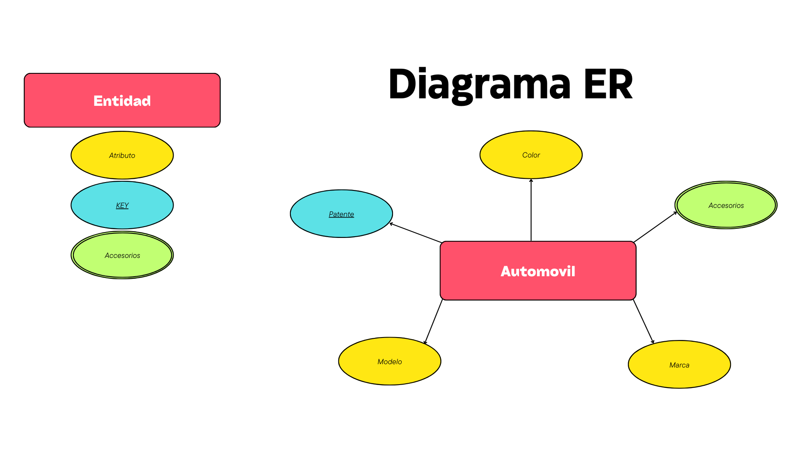
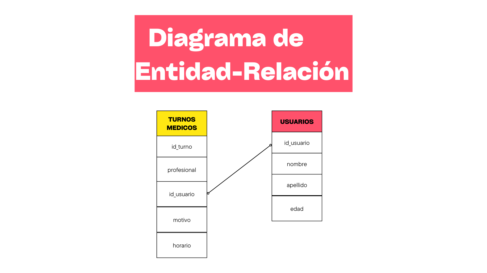
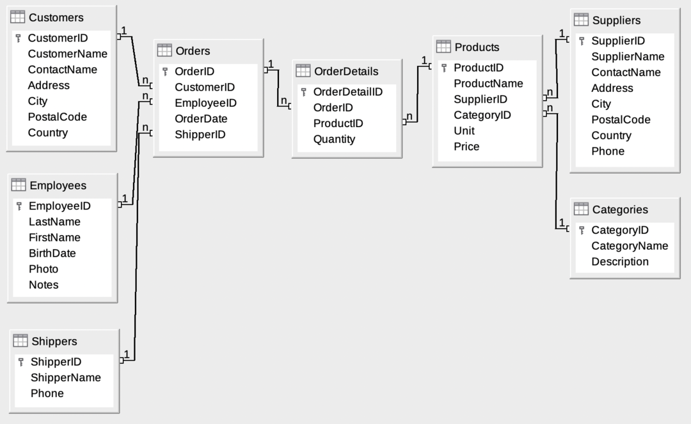

## ¿QUÉ ES SQL?

    Structured Query Language ➡ Lenguaje de consultas estructuradas.
    Es un lenguaje de programación estándar utilizado para gestionar y 
    manipular bases de datos relacionales.

## ¿QUÉ HACER EN SQL?
    
    ➡ Administrar: Crear, Modificar, Eliminar; Bases de Datos, Tablas u Objetos.
    ➡ Solicitar: Realizar consultas de datos para obtener información específica.
    ➡ Restricciones: Aplicar reglas específicas a las tablas.
    ➡ Otras funcionalidades: Generar informes, Analizar datos, etc.

## Modelo ER
    Es un modelo de datos que representa la estructura de una base de datos de manera gráfica.

    ➡ Entidades: Representan objetos del mundo real que tienen una existencia independiente. 
       Ejemplo: Una universidad, las entidades son: "Estudiante", "Profesor" y "Curso".

    ➡ Atributos: Son las propiedades o características de las entidades. 
       Ejemplo: "Estudiante" tiene atributos como "Nombre", "Edad" y "Matrícula".
            ➡ Atributos simples: no pueden dividirse en subpartes más pequeñas, 
            "Edad" de un "Estudiante" no se puede descomponer en partes más pequeñas.
            ➡ Atributos complejos: pueden dividirse en subpartes más pequeñas que 
            tienen su propio significado, "Nombre Completo" puede dividirse en "Nombre" y "Apellido".
            ➡ Key: Son atributos identifican de manera única a una entidad dentro de un conjunto de entidades

    ➡ Relaciones: Describen cómo las entidades están asociadas entre sí. 
       Ejemplo: La relación entre "Estudiante" y "Curso" sería "Inscrito en"..

## Ejercicio 1 🤓☝🏻:
    
#### Pensar una *ENTIDAD* que tenga 5 atributos, 1 _Multivalor_ , 1 _KEY_.

    ➡ Entidad: Automovil
        ➡ Atributos
            ➡ Multivalor: Accesorios
            ➡ Key: Patente
            ➡ Atributo: Modelo
            ➡ Atributo: Marca
            ➡ Atributo: Color

## Conceptos
    ➡ Tabla (Table): Organiza los datos en filas y columnas, 
    cada fila representa un registro único, y cada columna 
    representa un campo dentro del registro.
    ➡ Campo (Field): Es una columna en una tabla que representa 
    un atributo específico de los datos almacenados.
    ➡ Valor del campo (Field Value): Es el dato específico almacenado 
    en un campo para un registro en una tabla.
    ➡ Regristo (Record): Es una fila en una tabla que representa 
    una única instancia de los datos almacenados.
    ➡ Tipos de datos (Data Types): Definen el tipo de datos de un campo.
        ➡ Integer: Números enteros.
        ➡ Text: Cadenas de texto.
        ➡ Blob: Datos binarios grandes (imágenes o archivos).
        ➡ Real: Valones numéricos con decimales.
        ➡ Numeric: Valores numéricos enteros y decimales (Matemática precisa).
    ➡ Query: Obtener informacion de una base de datos, 
    recuperar, insertar, actualizar o eliminar datos.
        ➡ * = Obetener todo.
            ➡ Los textos siempre van entre ' '.
            
## Conceptos Practicos
    ➡ Obtener todos los registros de una tabla:
                ➡ SELECT * FROM *nombre de la tabla*;
    ➡ CRUD: Operaciones básicas en una base de datos.
            ➡ Create (Crear): INSERT INTO *nombre de la tabla* (campo1, campo2, campo3) 
                               VALUES ('valor1', 'valor2', 'valor3');
                    Ejmeplo: INSERT INTO usuarios (nombre, apellido, edad)
                             VALUES	('Edena', 'SQL', 20) 
                     ➡ Execution finished without errors.
                        Result: query executed successfully. Took 2ms, 1 rows affected
                        At line 1:
                        INSERT INTO usuarios (nombre, apellido, edad)
                        VALUES	('Edena', 'SQL', '20')
            ➡ Read (Leer): SELECT * FROM *nombre de la tabla*;
            ➡ Update (Actualizar): UPDATE *nombre de la tabla* SET campo1 = 'valor1' WHERE condición;
            ➡ Delete (Eliminar): DELETE FROM *nombre de la tabla* WHERE condición;
    ➡ AS: Se utiliza para renombrar una columna o tabla en una consulta SQL 
            sin modificar el nombre original en la base de datos.
            ➡ Ejemplo: SELECT precio*2 AS precio_doble FROM productos;
                ➡ Esto renombra la columna `precio*2` a `precio_doble` en la consulta.
    ➡ ORDER BY: Se utiliza para ordenar los resultados de una consulta SQL por una o más columnas.
            ➡ Ejemplo: SELECT * FROM usuarios ORDER BY apellido ASC;
                ➡ Esto ordena los resultados por la columna `apellido` en orden ascendente.
            ➡ `ASC` para orden ascendente (por defecto) y `DESC` para orden descendente.
                ➡ Ejemplo: SELECT * FROM usuarios ORDER BY edad DESC;
                    ➡ Esto ordena los resultados por la columna `edad` en orden descendente.
            ➡ Prioridad de ordenamiento en SQL:
                1. NULL: Se consideran los más bajos en el ordenamiento.
                    ➡ Para que evitar que se vean los NULL al principio:
                        ➡ *ASC NULLS LAST*
                    ➡ Para ver los NULL al principio:
                        ➡ *DESC NULL FIRST*
                2. Boolean (TRUE/FALSE): se ordenan con FALSE antes de TRUE.
                3. Integer/Real/Float/Numeric/Decimal: Los enteros se ordenan en orden numérico.
                6. Date/Time: Se ordenan cronológicamente.
                7. Text/String: Orden alfabético según el conjunto de caracteres del SGBD.
                    ➡ Caracteres especiales: Los caracteres especiales tienen su propia jerarquía 
                    y se ordenan antes de los caracteres alfanuméricos.
                        ➡ Jerarquía de caracteres especiales: !, ", #, $, %, &, ', (, ), *, +, ,, -, ., /, :, ;,
                        <, =, >, ?, @, [, \, ], ^, _, `, {, |, }, ~
                8. Blob: Los binarios no se ordenan directamente.
    ➡ DISTINCT: Eliminar los registros duplicados en los resultados de una consulta SQL.
        ➡ Ejemplo: SELECT DISTINCT nombre FROM usuarios;
            ➡ Devuelve solo los nombres únicos y sin repetir de la columna `nombre` en la tabla `usuarios`.
    ➡ ID: Identificador único para cada registro en una tabla.
            ➡ Clave primaria (Primary Key): Un campo o combinación de 
            campos que identifica de manera única cada registro en una tabla.
                ➡ Ejemplo: En la tabla "Usuarios", el campo "id_usuario" es la clave primaria.
                ➡ Las claves primarias deben ser únicas y no nulas.
            ➡ Clave foránea (Foreign Key): Un campo o combinación de campos 
            en una tabla que se refiere a la clave primaria de otra tabla.
                ➡ Ejemplo: En la tabla "turnos_medicos", el campo "id_usuario" es una clave foránea 
                que referencia a "id_usuario" en la tabla "usuarios".
                ➡ Se utiliza para establecer las relaciones entre tablas.

## Northwind Data Base

- **Customers (Clientes)**: Almacena información sobre los clientes, como `CustomerID` (clave primaria), `CompanyName`, `ContactName`, `ContactTitle`, `Address`, `City`, `Region`, `PostalCode`, `Country`, `Phone`, y `Fax`.

- **Orders (Pedidos)**: Almacena información sobre los pedidos realizados por los clientes. Incluye `OrderID` (clave primaria), `CustomerID` (clave foránea que referencia a `Customers`), `EmployeeID` (clave foránea que referencia a `Employees`), `OrderDate`, `RequiredDate`, `ShippedDate`, `ShipVia`, `Freight`, `ShipName`, `ShipAddress`, `ShipCity`, `ShipRegion`, `ShipPostalCode`, y `ShipCountry`.

- **Order Details (Detalles de Pedidos)**: Almacena información detallada sobre cada producto en un pedido. Incluye `OrderID` (clave foránea que referencia a `Orders`), `ProductID` (clave foránea que referencia a `Products`), `UnitPrice`, `Quantity`, y `Discount`.

- **Products (Productos)**: Almacena información sobre los productos disponibles. Incluye `ProductID` (clave primaria), `ProductName`, `SupplierID` (clave foránea que referencia a `Suppliers`), `CategoryID` (clave foránea que referencia a `Categories`), `QuantityPerUnit`, `UnitPrice`, `UnitsInStock`, `UnitsOnOrder`, `ReorderLevel`, y `Discontinued`.

- **Suppliers (Proveedores)**: Almacena información sobre los proveedores de productos. Incluye `SupplierID` (clave primaria), `CompanyName`, `ContactName`, `ContactTitle`, `Address`, `City`, `Region`, `PostalCode`, `Country`, `Phone`, `Fax`, y `HomePage`.

- **Categories (Categorías)**: Almacena información sobre las categorías de productos. Incluye `CategoryID` (clave primaria), `CategoryName`, y `Description`.

- **Employees (Empleados)**: Almacena información sobre los empleados. Incluye `EmployeeID` (clave primaria), `LastName`, `FirstName`, `Title`, `TitleOfCourtesy`, `BirthDate`, `HireDate`, `Address`, `City`, `Region`, `PostalCode`, `Country`, `HomePhone`, `Extension`, `Photo`, `Notes`, `ReportsTo`, y `PhotoPath`.

- **Shippers (Transportistas)**: Almacena información sobre las compañías de transporte. Incluye `ShipperID` (clave primaria), `CompanyName`, y `Phone`.

### Relaciones entre tablas

- **Customers** y **Orders**: `CustomerID` en `Orders` es una clave foránea que referencia a `CustomerID` en `Customers`. Esto indica qué cliente realizó cada pedido.

- **Orders** y **Order Details**: `OrderID` en `Order Details` es una clave foránea que referencia a `OrderID` en `Orders`. Esto detalla qué productos están incluidos en cada pedido.

- **Products** y **Order Details**: `ProductID` en `Order Details` es una clave foránea que referencia a `ProductID` en `Products`. Esto indica qué productos específicos están en cada detalle de pedido.

- **Products** y **Suppliers**: `SupplierID` en `Products` es una clave foránea que referencia a `SupplierID` en `Suppliers`. Esto indica qué proveedor suministra cada producto.

- **Products** y **Categories**: `CategoryID` en `Products` es una clave foránea que referencia a `CategoryID` en `Categories`. Esto clasifica los productos en diferentes categorías.

- **Orders** y **Employees**: `EmployeeID` en `Orders` es una clave foránea que referencia a `EmployeeID` en `Employees`. Esto indica qué empleado gestionó cada pedido.

- **Orders** y **Shippers**: `ShipVia` en `Orders` es una clave foránea que referencia a `ShipperID` en `Shippers`. Esto indica qué compañía de transporte se utilizó para enviar cada pedido.
